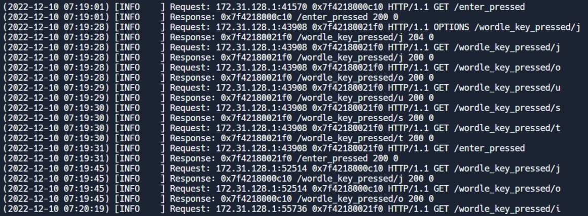

# Tuffle

In the game Tuffle (based on the game Wordle), the user is trying to guess a secret 5 letter word. The user will type in a 5 letter guess, and the server will share information about how close the guess is to the actual answer.

## Tuffle Backend

The Tuffle Backend Server will track the state of the game. The backend is responsible for handling the logic that powers the game - from the selection of a random Tuffle secret word, to the verification of the validity of a submitted guess.

See the [Tuffle Project Spec](https://tinyurl.com/cpsc121-f22-tuffle) for detailed instructions on the Tuffle Backend Server implementation, the API that enables the Tuffle frontend and backend to communicate, and an overview of how the data sent from the server is parsed on the frontend to update the UI.

## Background and Rules

If a letter in the guess exactly matches a letter in the answer (same letter and correct position), the letter will be marked green.
If a letter in the guess almost matches a letter in the answer (same letter, but incorrect position), the letter will be marked yellow.
If a letter in the guess doesn’t match a letter in the answer (guessed letter doesn’t exist in answer), the letter will be marked gray.

The user will use this information to then make another guess, and will keep guessing until they guess the answer (they win), or they run out of their 6 guesses (they lose).

For example, if the secret answer is TOWEL and the user guesses LOWER, the computer should display:
L O W E R

The O, W, and E are all green because the user guessed those letters in the correct position.
The L is yellow because L is the last letter in the answer, but the user guessed it in the first position.
The R is gray because it does not appear in the answer.

## API Design

Every time the user interacts with a game, an HTTP request is made to the Tuffle Backend API you implement. A request will be routed to one of the following endpoints (functions) in tuffle.h:

LetterKeyPressed(char key)
Every time a letter is pressed, this function will be called. Your C++ server will receive the letter that was pressed in the parameter `key`
EnterKeyPressed()
Every time the enter key is pressed, this function will be called. This function is responsible for checking the guess that was submitted.
DeleteKeyPressed()
Every time the backspace key is pressed, this function will be called.
NewGame()
When the user clicks on the “Next Tuffle” button, this function will be called.

## Installation

`Clone repo through replit

make all tests

Run program while make all tests is in progress

R = run backend

copy url and place into "Tuffle application(link below)" backend and hit save

Start new game over by hitting "Give Up"`

## Tuffle application

## Building

## Screenshot of remote user

## Contribution

Erik Williams
